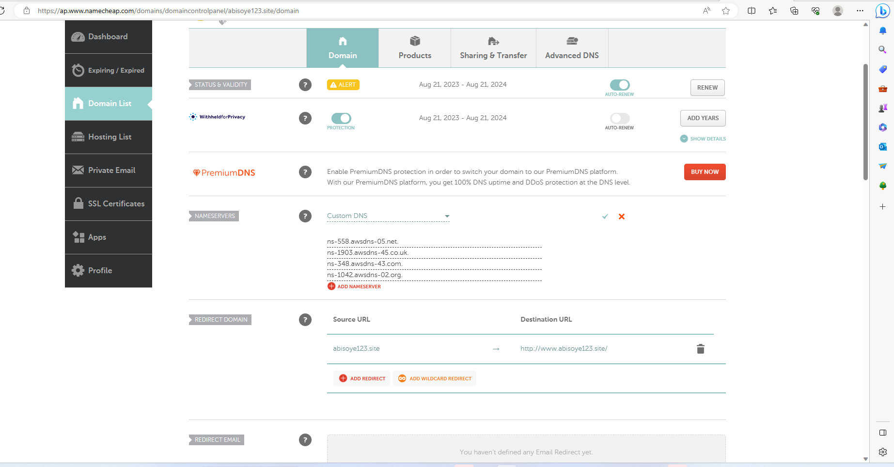
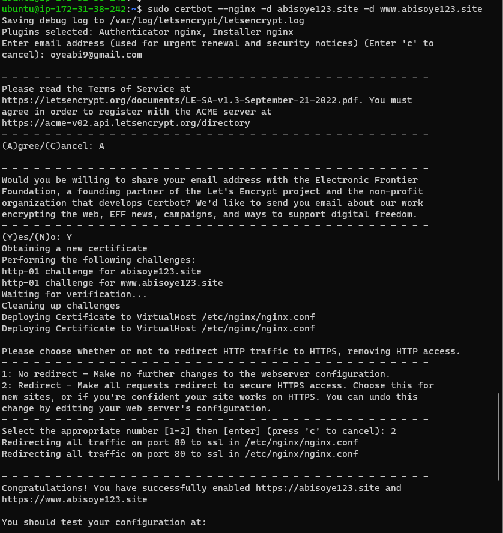
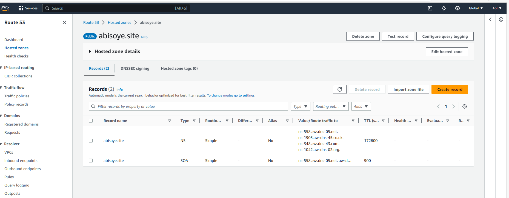
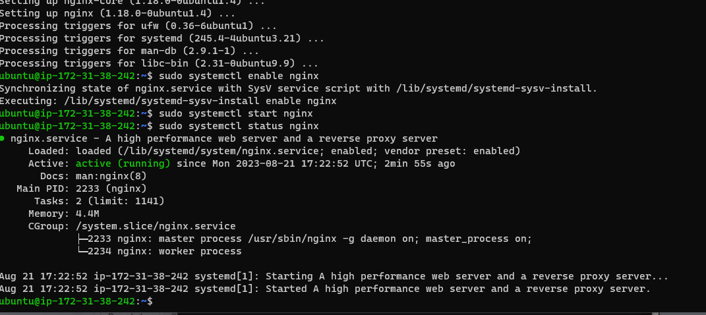
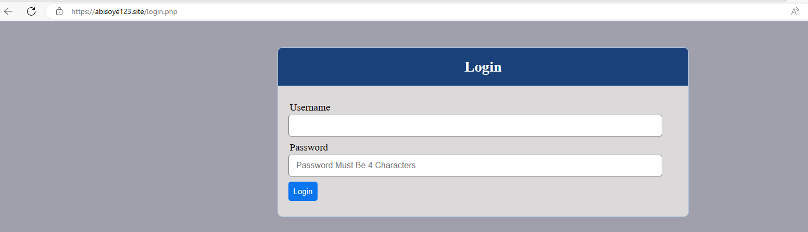
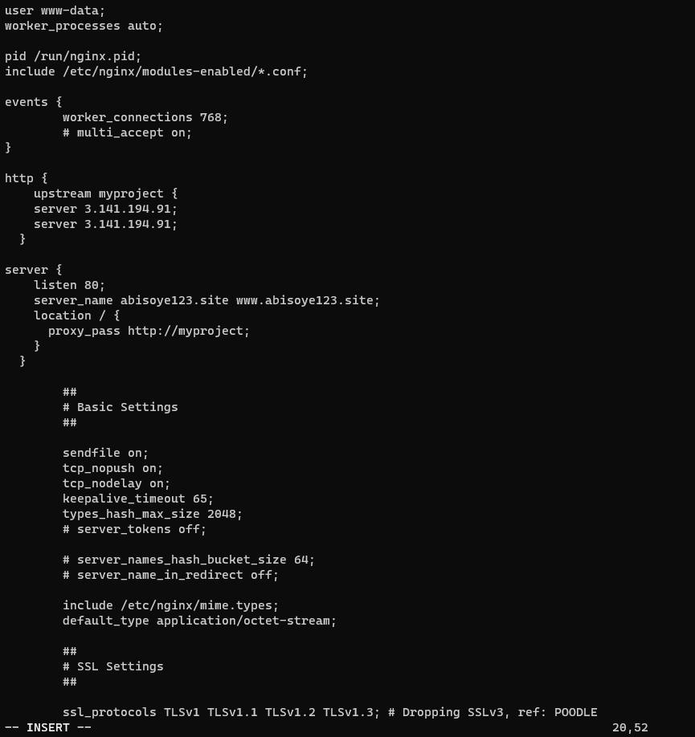
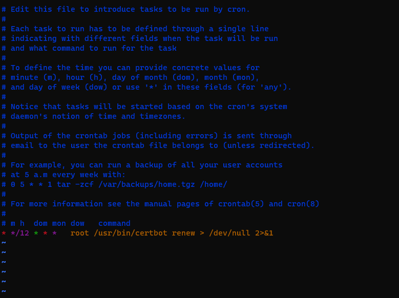

## LOAD BALANCER SOLUTION WITH NGINX AND SSL
## By now you have learned what Load Balancing is used for and have configured an LB solution using Apache, but a DevOps engineer must be a versatile professional and know different alternative solutions for the same problem. That is why, in this project we will configure an Nginx Load Balancer solution.

## It is also extremely important to ensure that connections to your Web solutions are secure and information is encrypted in transit – we will also cover connection over secured HTTP (HTTPS protocol), its purpose and what is required to implement it.

When data is moving between a client (browser) and a Web Server over the Internet – it passes through multiple network devices and, if the data is not encrypted, it can be relatively easy intercepted by someone who has access to the intermediate equipment. This kind of information security threat is called Man-In-The-Middle (MIMT) attack.

This threat is real – users that share sensitive information (bank details, social media access credentials, etc.) via non-secured channels, risk their data to be compromised and used by cybercriminals.

SSL and its newer version, TSL – is a security technology that protects connection from MITM attacks by creating an encrypted session between browser and Web server. Here we will refer this family of cryptographic protocols as SSL/TLS – even though SSL was replaced by TLS, the term is still being widely used.

SSL/TLS uses digital certificates to identify and validate a Website. A browser reads the certificate issued by a Certificate Authority (CA) to make sure that the website is registered in the CA so it can be trusted to establish a secured connection.

There are different types of SSL/TLS certificates – you can learn more about them here. You can also watch a tutorial on how SSL works here or an additional resource here

In this project you will register your website with LetsEnrcypt Certificate Authority, to automate certificate issuance you will use a shell client recommended by LetsEncrypt – cetrbot.

Task
This project consists of two parts:

## Configure Nginx as a Load Balancer
Register a new domain name and configure secured connection using SSL/TLS certificates
Your target architecture will look like this:

 

Instructions On How To Submit Your Work For Review And Feedback
To submit your work for review and feedback – follow this instruction.

Projects
Docs
## (STEP 20) PROJECT 10: Load Balancer Solution With Nginx and SSL/TLS
CONFIGURE NGINX AS A LOAD BALANCER
You can either uninstall Apache from the existing Load Balancer server, or create a fresh installation of Linux for Nginx.

### Create an EC2 VM based on Ubuntu Server 20.04 LTS and name it Nginx LB (do not forget to open TCP port 80 for HTTP connections, also open TCP port 443 – this port is used for secured HTTPS connections)
Update /etc/hosts file for local DNS with Web Servers’ names (e.g. Web1 and Web2) and their local IP addresses
Install and configure Nginx as a load balancer to point traffic to the resolvable DNS names of the webservers
Update the instance and Install Nginx

## sudo apt update
sudo apt install nginx
Configure Nginx LB using Web Servers’ names defined in /etc/hosts

Hint: Read this blog to read about /etc/host

Open the default nginx configuration file

sudo vi /etc/nginx/nginx.conf

#insert following configuration into http section

 upstream myproject {
    server Web1 weight=5;
    server Web2 weight=5;
  }

server {
    listen 80;
    server_name www.domain.com;
    location / {
      proxy_pass http://myproject;
    }
  }

#comment out this line
#       include /etc/nginx/sites-enabled/*;

Restart Nginx and make sure the service is up and running

sudo systemctl restart nginx
sudo systemctl status nginx
Side Self Study: Read more about HTTP load balancing methods and features supported by Nginx on this page
